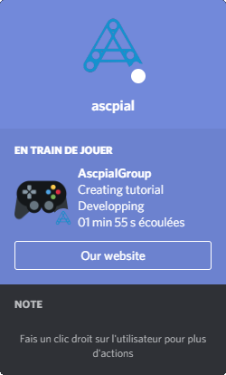
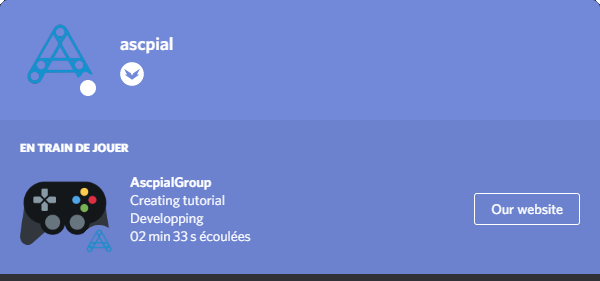
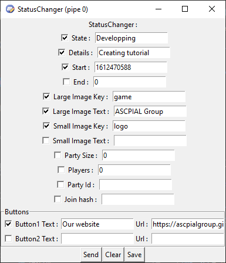
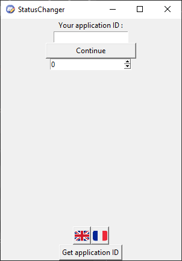
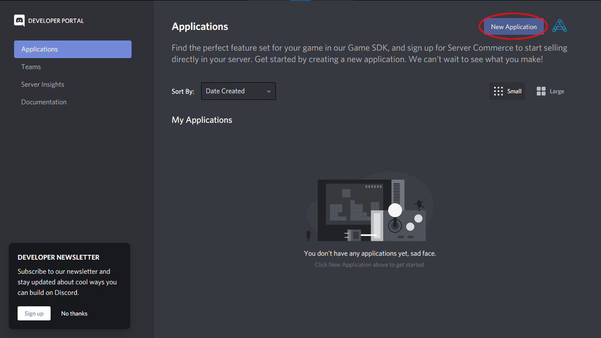
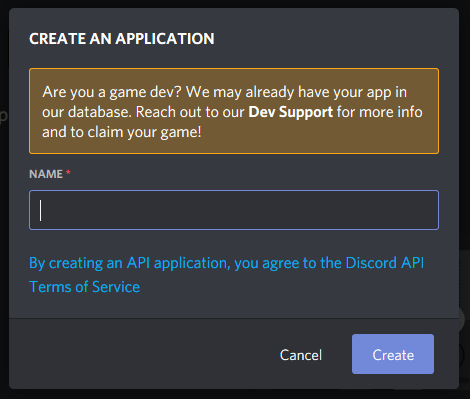
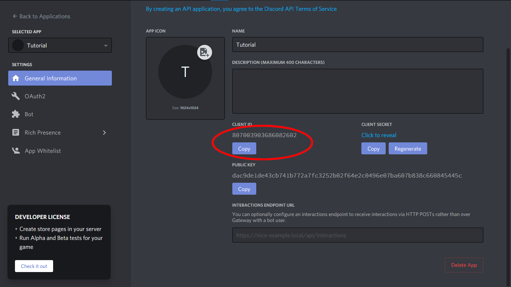
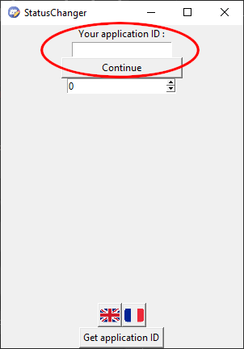
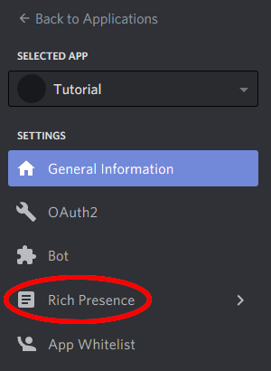

# Discord StatusChanger

## Presentation

This program allows you to create advanced personalized status on discord such as this one :

It uses the [Discord RPC Client](https://discord.com/developers/docs/topics/rpc) and a very simple interface :

## Prerequisite

You must be connected to discord's application and you must have an [discord application ID](https://discord.com/developers/applications) (refer to the `Create your own game` section).

After having installed and launched the application, this interface appears :

> A french translation is available on the first window

Put your application ID and click on `Continue`.

This new interface appears. I advise you to go check the [ discord documentation](https://discord.com/developers/docs/rich-presence/how-to#updating-presence-update-presence-payload-fields) to know what each field correspond to.

> To send your rich presence, click on `send`. If you  want to remove your personalized status without closing the app, click on `remove`. To save your own configuration without sending the rich presence, click on `save`.

## Downloads

To download an executable or an installer, refer to the download folder [downloads](https://github.com/ascpial/StatusChanger/tree/main/downloads).

- [Executable file](https://github.com/ascpial/StatusChanger/blob/main/downloads/StatusChanger.exe)
- [Installer](https://github.com/ascpial/StatusChanger/blob/main/downloads/StatusChangerInstaller.exe)

## Create your own game

To change the name of the "game" you're playing, you must create an application on the [ discord developpement] page (https://discord.com/developers/applications).

Create an "application":

The requested name will be the name of the "game" you want to create. You can always change it.

After the creation of the "application", you can give it a logo.

To use your game in Status Changer, copy your application ID and paste it in the first window of Status Changer :

Now go in the `Rich Presence` tab :

You can add the default logo of the game here.
You can also add more images with the Rich `Presence Assets`, where you can add images (it can take time before Discord saves the modifications) you can use in the `Large Image Key` and `Small Image Key` field of Status Changer.