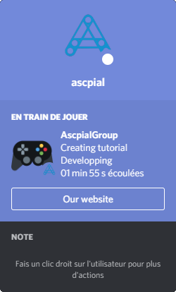
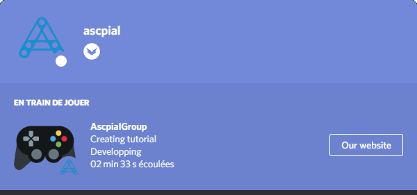
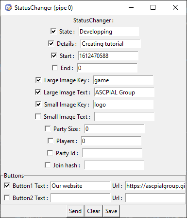
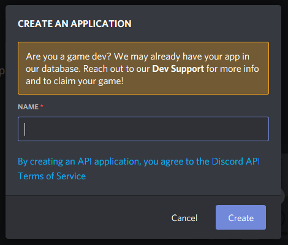
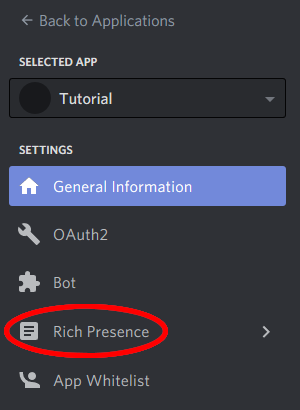

# Discord StatusChanger

## Présentation

Ce programme permet de créer des status avancés personnalisés tels que celui ci sur discord :

Il utilise le [client RPC de discord](https://discord.com/developers/docs/topics/rpc) et une interface très simple :

## Prérequis

Vous devez avoir un compte discord sur l'application bureau et un [id d'application discord](https://discord.com/developers/applications) (référez vous à la section `Créez votre propre jeu`).

Après avoir installé et lancé l'application, cette interface apparaît :

> Une traduction en français est disponible sur la première fenêtre

Mettez votre ID d'application dans le champs de saisie et sélectionnez `Continuer`.

Cette nouvelle interface apparaît et je vous invite à aller voir la [documentation discord](https://discord.com/developers/docs/rich-presence/how-to#updating-presence-update-presence-payload-fields) pour savoir à quoi correspondent chaque champ.

> Pour envoyer votre riche presence, appuyez sur `Envoyer`. Si vous voulez retirer votre status sans fermer l'application, appuiez sur `Effacer`. Pour sauvegarder votre configuration sans envoyer le rich presence, appuiyez sur `Sauvegarder`

## Créez votre propre jeu

Pour changer le nom du jeu auquel vous jouez, vous devez créer une application sur la page de [développement de discord](https://discord.com/developers/applications).

Créez une application :

Le nom demandé sera le nom du jeu que vous allez créer. Il est modifiable après la création.

Après la création de l'application, vous pouvez lui donner un logo.

Pour pouvoir utiliser votre jeu dans l'application, copiez votre ID d'application et collez le sur la première fenêtre de l'application :

 Allez ensuite dans l'onglet `Rich Presence` :

Vous pouvez ajouter ici le logo par défaut du jeu.
Vous pouvez aussi ajouter des images supplémentaires avec la section `Rich Presence Assets`, où vous pouvez ajouter des images (attention parfois celà peut prendre du temps avant que discord prenne en compte vos modifications) que vous pourrez utiliser avec les champs de saisie `Large Image Key` et `Small Image Key` de l'application.